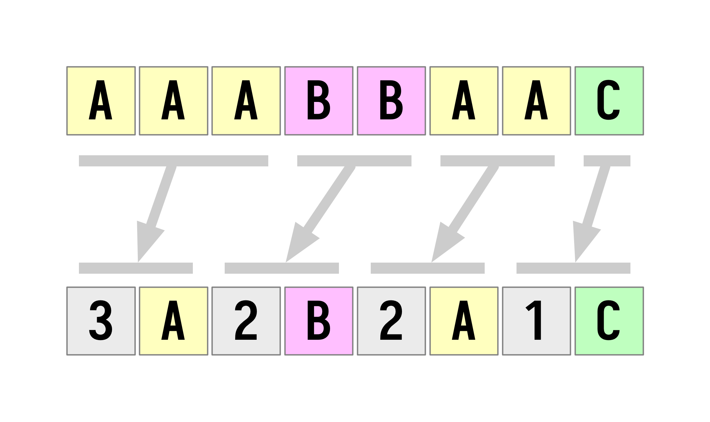

# The Compression Puzzle




One lovely Friday we were faced with this nice yet intriguing programming puzzle.

```
One shall write a program that compresses string "AAABBAAC" to its compressed form "3A2B2A1C".
```

These attempts were made,...

## Basic rules

1. No external libraries or tools shall be used. Only [standard, bundled libraries](https://en.wikipedia.org/wiki/Standard_library) apply.
2. "[Assert](https://en.wikipedia.org/wiki/Assertion_(software_development))" inside your solution if the function does what it is suppose to do.
3. You can apply as many solutions as you want to any language you want.
4. [Assume that](https://github.com/otobrglez/compression-puzzle/issues/29) the input is always a sequence of ASCII upper-case characters (no numbers or symbols).

## Additional Q/A

- **What if my language is not yet supported?** No problem. Just pretend that it does and provide some instructions on how can it be ran in the PR. We'll try to use the wizzardy of [Nix](https://nixos.org/) and/or [Docker](https://www.docker.com/) to compile and run it along with others.
- **Can I submit multiple solutions?**
Yes; please do.
- **Should we benchmark the solutions agains each other?**
Possibly.
- **Why are you doing this?**
Because its fun!
- **Will there be any recap/summary/article written?**
Hopefully, yes.
- **How can I contact you?**
Try [@otobrglez](https://twitter.com/otobrglez) on Twitter or via [GitHub issues](https://github.com/otobrglez/compression-puzzle/issues) or something.

## Development

```bash
# Via Nix Shell
$ nix-shell shell.nix --run "make run"
# if you preffer to roll your own local brew
$ make
```

To run individual languages use:

```bash
make bash
make c++
make crystal
make clojure
make cs
make elixir
# ...
make php
```

## Benchmarking

Although benchmarking is not the primary goal of this project; some authors are really kean to measure the performance of their solutions and compare them to others.

These languages have benchmarking suites made and feel free to give them a try.

```bash
# Python
python src/python/benchmarks.py

# F#
./src/fsharp/benchmark.fsx

# Crystal
./src/crystal/benchmark
```

P.s.: If you feel the urge that you need to benchmark your solution agains others; please feel free to do so and attach some instructions to [your PR](https://github.com/otobrglez/compression-puzzle/pulls).

## Authors

| Author | Solutions |
| --- | --- |
|[Alex Piechowski](https://github.com/grepsedawk) | [Crystal](src/crystal/compress_lexer.cr)|
|[Aleš Justin](https://github.com/alesj) | [Java](src/java/Compression.java)|
|[Andraž Brodnik](http://github.com/brodul) | [Python](src/python/compress_brodul.py)|
|[Bartłomiej Tomala](https://github.com/btomala) | [Scala](src/scala/CompressionPuzzle03.scala)|
|[Blaž Smolnikar](https://github.com/GrandFelix) | [PHP](src/php/compress_grandfelix.php), [Swift](src/swift/compress_extension_grandfelix.swift)|
|[Boleslav Březovský](http://github.com/rebolek) | [Red](src/red/compress-rebolek.red)|
|[Boris](https://github.com/hiiamboris) | [Red](src/red/compress-hiiamboris.red)|
|[David Kuridža](https://github.com/davidkuridza) | [Go](src/go/compress_david.go)|
|[David Ličen](https://github.com/davision) | JavaScript: [compress_da01.js](src/javascript/compress_da01.js), [compress_da02.js](src/javascript/compress_da02.js)|
|[Goran Kodrun](https://github.com/liveandie) | [JavaScript](src/javascript/compress_go.js), [TypeScript](src/ts/compress_go2.ts)|
|[Gregg Irwin](https://github.com/greggirwin) | [Red](src/red/compress-gregg.red)|
|[Janko Metelko](https://github.com/refaktor) | Rye: [compress_jm_iter.rye](src/rye/compress_jm_iter.rye), [compress_jm_iter_steps.rye](src/rye/compress_jm_iter_steps.rye), [compress_jm_rec.rye](src/rye/compress_jm_rec.rye), [compress_jm_rec_steps.rye](src/rye/compress_jm_rec_steps.rye), [compress_js_hofs.rye](src/rye/compress_js_hofs.rye), [SQLite](src/sqlite/compress_rec.sql)|
|[Jernej Virag](https://github.com/izacus) | [Kotlin](src/kotlin/compress.kts)|
|[Klemen Kogovšek](https://github.com/kkogovsek) | [JavaScript](src/javascript/compress_reduce_klemen.js), [ReScript](src/rescript/PatternMatchCompress.res)|
|[Krištof Črnivec](https://github.com/MrChriss) | Ruby: [compress-kbc-0.rb](src/ruby/compress-kbc-0.rb), [compress-kbc-1.rb](src/ruby/compress-kbc-1.rb)|
|[Luka Kacil](https://github.com/lknix) | [Bash](src/bash/compress_lk.sh), Python: [compress_luka.py](src/python/compress_luka.py), [compress_luka_faster.py](src/python/compress_luka_faster.py), [compress_luka_rec1.py](src/python/compress_luka_rec1.py), [compress_luka_rec2.py](src/python/compress_luka_rec2.py), [compress_luka_tailrec.py](src/python/compress_luka_tailrec.py)|
|[Marek Fajkus](https://github.com/turboMaCk) | [Haskell](src/haskell/Compress_turbomack.hs)|
|[Miha Kloar](https://github.com/mkloar) | [TypeScript](src/ts/compress_mk.ts)|
|[Miha Novak](https://github.com/mihanovak1024) | [Kotlin](src/kotlin/mn1024_compress.kts)|
|[Milan Slunečko](https://github.com/smi11) | Lua: [compress.lua](src/lua/compress.lua), [compress-gsub.lua](src/lua/compress-gsub.lua)|
|[Mitja Živković](https://linkedin.com/in/mitja-živković-367206) | [Go](src/go/compress_mitja.go)|
|[Nace Štruc](https://github.com/nacestruc) | C#: [Program.cs](src/cs/ns/Program.cs), [Program.cs](src/cs/ns2/Program.cs), [Program.cs](src/cs/ns3/Program.cs), [MS SQL](src/ms-sql/compression-puzzle.sql)|
|[Nejc Ilenič](https://github.com/inejc) | C++: [compress_fast.cpp](src/c++/compress_fast.cpp), [compress_slow.cpp](src/c++/compress_slow.cpp)|
|[Nejc Pušnik](https://github.com/cjenp) | [C#](src/cs/cjenp/Program.cs)|
|[Oto Brglez](https://github.com/otobrglez) | [JavaScript](src/javascript/compress_ob.js), [Python](src/python/compress_ob.py), Scala: [CompressionPuzzle01.scala](src/scala/CompressionPuzzle01.scala), [CompressionPuzzle02.scala](src/scala/CompressionPuzzle02.scala)|
|[Peter A. Pirc](https://github.com/papsl) | [C#](src/cs/pp/Program.cs)|
|[Peter Keše](https://github.com/pkese) | F#: [compress-pk1.fsx](src/fsharp/compress-pk1.fsx), [compress-pk2.fsx](src/fsharp/compress-pk2.fsx), [compress-pk3.fsx](src/fsharp/compress-pk3.fsx)|
|[Peter Levart](https://github.com/plevart) | [Java](src/java/Compression.java)|
|[Rob Cole](https://github.com/robcole) | [Crystal](src/crystal/compress_kbc_0.cr)|
|[Rok Kreslin](https://github.com/rokkreslincom) | [JavaScript](src/javascript/compress_rk.js)|
|[Roman Luštrik](https://github.com/romunov) | [Python](src/python/compress_romunov.py), [R](src/r/compress_romunov.R)|
|[Simon Belak](https://github.com/sbelak) | [Clojure](src/clojure/clojpression-puzzle/src/clojpression_puzzle.clj)|
|[Simon Žlender](https://github.com/szlend) | Elixir: [compress.exs](src/elixir/compress.exs), [compress_rec.exs](src/elixir/compress_rec.exs), [Rust](src/rust/compress.rs)|
|[Tit Petrič](https://github.com/titpetric) | [Go](src/go/compress_tit.go)|
|[Tomaž Štih](https://github.com/tstih) | [C](src/c/tomaz.c)|
|[Urban Škudnik](https://github.com/uskudnik) | [Python](src/python/compress_urban.py)|

## The Stats 📈
- The number of authors: 36
- The number of solutions: 64
- The number of programming languages: 27
- The language / solutions breakdown: Python: 9, JavaScript: 6, Rye: 5, C#: 5, Red: 3, Go: 3, F#: 3, Scala: 3, TypeScript: 2, Lua: 2, Crystal: 2, C++: 2, Kotlin: 2, Java: 2, Ruby: 2, Elixir: 2, C: 1, Swift: 1, PHP: 1, SQLite: 1, ReScript: 1, Bash: 1, Haskell: 1, MS SQL: 1, R: 1, Clojure: 1, Rust: 1


